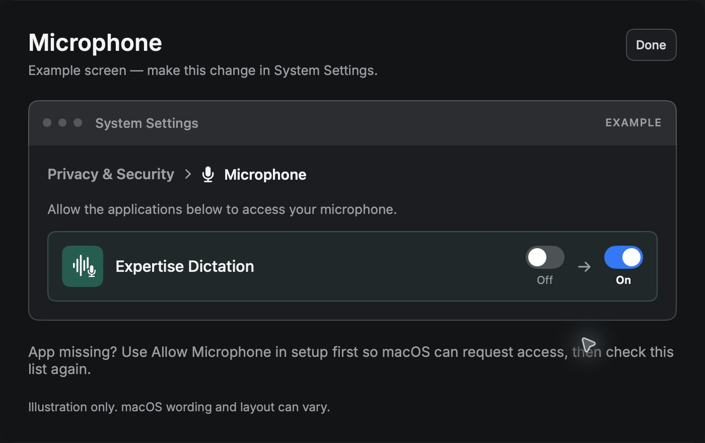
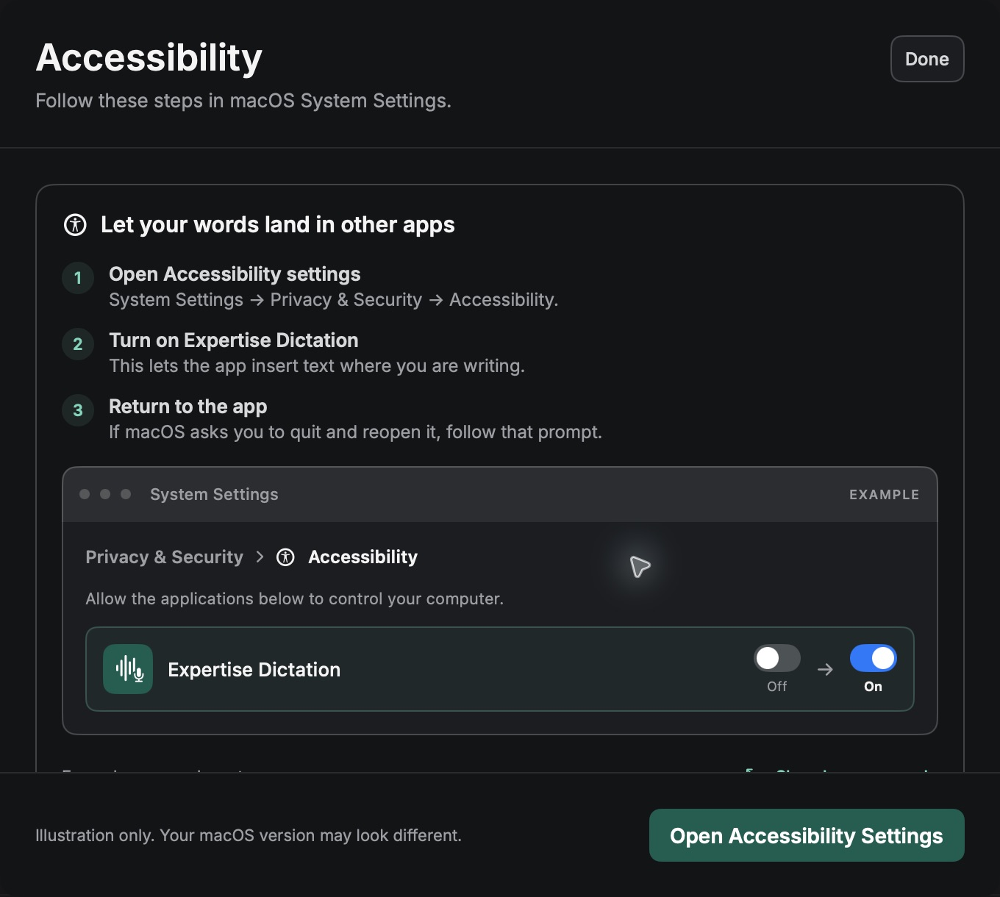
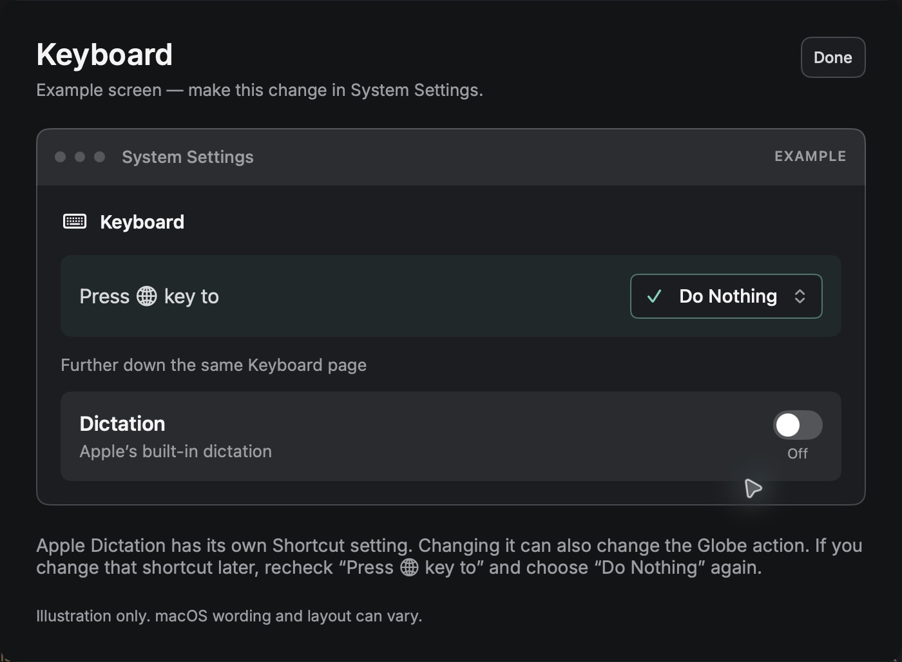
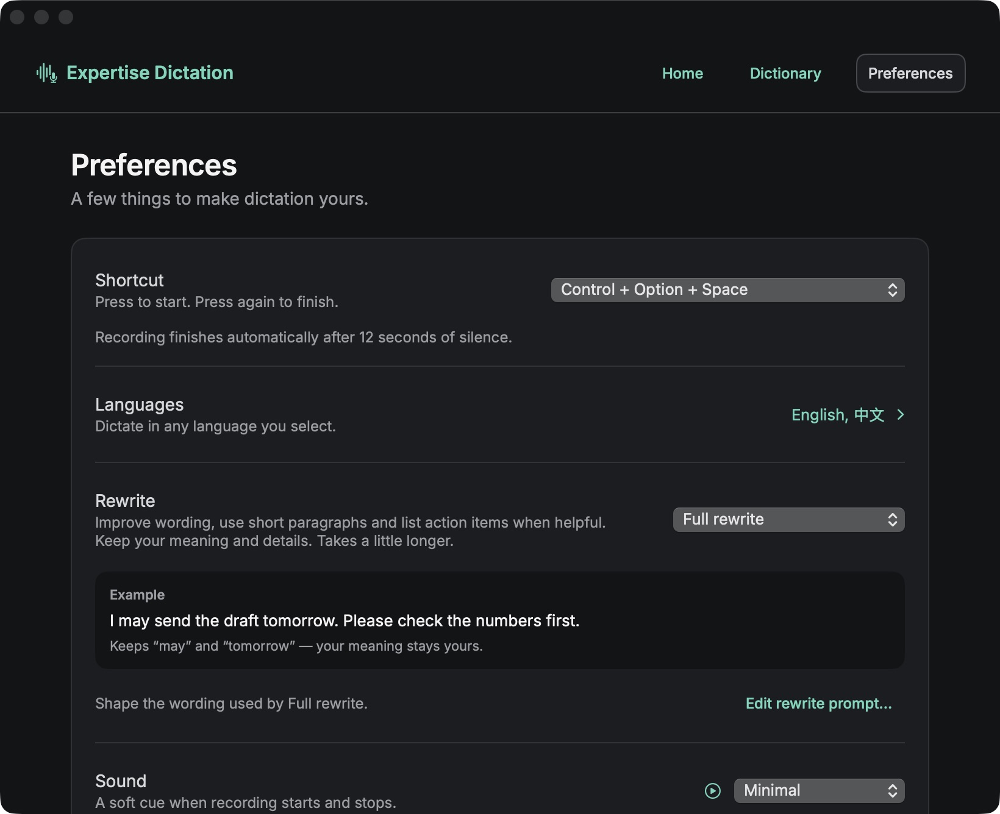

# Expertise Dictation — usage guide

1.1.10 personal connection guide · macOS 14 or later · Apple silicon and Intel

**Connection:** This release uses your own provider API key. Existing saved keys carry over; new users add a key in Connection settings. Provider charges apply. The free hosted service is not included. Download a published installer from the [releases page](https://github.com/shengha2/expertise-dictation-releases/releases), and check its release notes and installer receipt for the exact validation and Apple notarization status.

Expertise Dictation types your speech where you are writing. It uses OpenAI or your selected provider, independently of Apple's built-in Dictation.

## Install or update

1. Download the DMG from the release page.
2. Finish any active dictation and quit the older app.
3. Open the DMG and drag **Expertise Dictation** into **Applications**. Replace the older copy when asked.
4. Open the copy in Applications. Look for its microphone icon in the menu bar.

The app keeps the original bundle identity, so upgrades preserve preferences, saved keys, dictionary, history and recovery recordings. If an old **FnDictate** copy is still running, quit it before opening Expertise Dictation.

Choose **Check for Updates…** in the menu bar to look immediately. Automatic checking and installation are in **Preferences → More options → Updates**. Version 1.1.9 defaults to hourly checks; an existing explicit update preference is preserved. Earlier versions keep their own schedule until upgraded. Updates are checked periodically, not delivered instantly by push notifications.

Home also shows your installed version and **Check for updates**. A manual check brings the updater's response forward. When a downloaded update is ready, the action changes to **Restart to update**. A published version older than or equal to your installed version is not an upgrade.

When an update has downloaded, its version and **Restart to update** action stay visible. With automatic installation enabled, it can restart after 15 seconds of safe idle time with setup and Preferences closed. It waits while you dictate, process text, inspect a Copy/error card, or edit a sheet. Copy any pending text and dismiss the card first. **Restart to update** lets you proceed from Preferences when there is no recording, pending result, editing sheet or unsaved settings draft. Save, add or clear an unfinished API-key or dictionary edit before restarting.

A new app must actually be published in the signed update feed before anyone can receive it. A locally built DMG does not update that feed. Versions before 1.1.4 need a manual DMG upgrade once because they do not have the configured update channel.

Published distribution builds must be signed with Developer ID and notarized by Apple. A local source build may still be blocked by macOS or need renewed permissions. Do not disable Gatekeeper globally. [Apple explains the app-specific installation choices](https://support.apple.com/102445).

## Set up once

Setup follows five steps. Each step checks the thing it asks you to do. **Set up later** leaves setup unfinished so you can return through **Check setup**.

Before the practice dictation, open **Connection settings**, paste your provider API key and click **Save**. You can reach it from setup or **Preferences → More options → Connection**. Return to **Finish setup** afterward; completed microphone and shortcut checks are kept unless those inputs change. If you already used a personal connection, its saved keys and provider choices remain available.

### 1. Permissions

Click **Allow microphone**, then Allow in the macOS prompt. If it was previously denied, use **Open Microphone Settings** and enable Expertise Dictation under **Privacy & Security → Microphone**.

For typing and the shortcut, use **Open Accessibility Settings** and enable Expertise Dictation under **Privacy & Security → Accessibility**. This is the page inside Privacy & Security, not the main Accessibility section. If the app is absent, use **+**, select the app in Applications and add it. Authenticate if macOS requests it.

These are screenshots of the app’s example guides, not your live System Settings.

Use the illustrated help beside each permission if you need guidance. The diagrams are examples; the **Open Settings** button takes you to the real system control. Return to the app after making the change.

### 2. Microphone

Start the check and say a short sentence. The meter should move and the app should confirm it heard sound. A microphone with permission but no incoming sound does not pass this step. If necessary, choose the built-in microphone and try again.

### 3. Shortcut

**Fn / Globe** is the default. Press and release it once when asked. The key drawing reacts while you hold it, and Continue becomes available after the app detects the complete gesture.

If Fn also opens emoji or Apple's Dictation:

1. Open **System Settings → Keyboard** using the guide's button.
2. Turn off Apple's **Dictation**, or give it a different shortcut.
3. Set **Press 🌐 key to / Press fn key to** to **Do Nothing**.
4. Recheck that choice after changing Apple's Dictation shortcut, then return to the app and retry Fn.

You can choose another shortcut if your keyboard makes Fn inconvenient. If the shortcut connection fails, use **Retry shortcut connection**. If macOS requests Input Monitoring, enable the app in **Privacy & Security → Input Monitoring** and follow its reopen instruction. The app does not change macOS security permissions for you.

### 4. Try it

Click the practice message field. Press Fn, speak, then press Fn again. Your text should appear in that field. Setup only marks practice complete after the controller confirms insertion; typing the sample yourself does not count.

If the provider connection is missing, choose **Open connection settings**, save your key, and return to setup. If a provider request fails, check that connection and retry; completed local checks are kept. The personal release does not ask you to wait for a free-service deployment.

### 5. Ready

Review your shortcut and languages. Choose every language you speak, such as English alone or English plus Chinese and French. Chinese offers Simplified or Traditional writing. Language selection guides recognition; it does not request translation.

## Daily dictation

Click where you want text, tap Fn, speak, and tap Fn again. You can also hold Fn while speaking and release it to finish. The start sound means recording is ready; the different stop sound means capture has ended. Text processing can continue briefly afterward.

Press **Esc** to cancel. About 12 seconds without speech activity ends recording automatically. If you have spoken, captured speech is processed; an empty result closes quietly.

Select a rewrite level in Preferences:

| Mode | What it does |
| --- | --- |
| **Full rewrite** — default for new installs | Improves wording and structure with restrained edits. Keeps short messages short and uses paragraphs or simple lists when helpful. |
| **Light rewrite** | Keeps your wording and order, removes obvious disfluency, and fixes punctuation. |
| **No rewrite** | Keeps the transcription engine's returned text. No rewrite model, replacement rules or local cleanup pass. The transcriber may already have supplied punctuation. |

This settings screenshot uses an alternate shortcut chosen during testing; Fn remains the new-install default.

All modes can contain recognition mistakes. Full and Light check names, numbers, literal values and meaning; if a rewrite fails a check, the original text is retained. Chinese/English dictation preserves the English words instead of silently translating them. Existing explicit rewrite preferences are retained on upgrade.

### Translation

From idle, double-tap Fn before speaking. The bar shows your target language. Speak and tap Fn again to finish. To dictate in the original language, use a single tap instead.

Choose the translation language in **Preferences → More options → Translation**. **Start Translation to…** in the menu bar is an alternative to the gesture. Translation is intentionally separate from selecting multiple recognition languages.

### Dictionary and email addresses

Open **Dictionary** to add names and technical terms. Add explicit replacement rules only when you want a phrase changed consistently. No rewrite bypasses those text replacement rules.

For an email address, spell the name clearly: “S A R A at gmail dot com.” Full and Light can format that as `sara@gmail.com`. Say “dot,” “underscore,” “hyphen,” or “plus” for those characters. Check an important address before using it; recognition is not an address-verification service.

### Edit or inspect the prompts

Open **Preferences → Edit rewrite prompt…**. Edit the Full rewrite style, then click **Save**. Cancel discards the draft. **Restore default** changes the draft; Save applies it. Changes affect the next dictation, so an ongoing recording keeps the prompt it started with.

**View all public prompt files** opens the bundled text files for Full rewrite, Light cleanup, punctuation and the meaning checker. These are also in the [public source repository](https://github.com/shengha2/expertise-dictation/tree/main/prompts). Dynamic dictionary, language and insertion context are assembled by the open source code. Editable style instructions do not disable fidelity checks.

## When typing cannot be completed

If you change text fields while recording, or the target cannot be identified safely, the app shows **Your text is ready** with the complete text, **Copy** and a close button. Copy, choose the field you want, then paste. Long text scrolls inside the card. Dismiss or Esc closes it.

The app deliberately avoids pasting into an unknown field. If a particular app repeatedly offers Copy, check Accessibility permission and select the actual composer before Fn. Report the app and the sequence that causes the failure; do not share private dictated content or API keys.

## Long recordings and interruptions

Audio is saved on this Mac before it is sent, in bounded segments. A recording succeeds only after every segment has completed. Network failures, sleep and app interruptions retain captured audio for **Recover Saved Recording…** or Home's **Retry recording** action. Cancelling a recovery attempt keeps the saved recording.

The two-hour maximum is a safety limit, not a claim that every two-hour session has been tested. Audio spoken while the microphone is unavailable cannot be recovered. Provider quotas and network failures can temporarily stop processing; saved recordings remain available for retry.

## Privacy and cost

Requests in this personal release go to your configured provider and are billed to your account. Your provider key is never part of the app download or public source. Audio and text handling at the provider depends on that account's settings and terms.

A separate hosted service remains under development. It is not part of this personal release, which does not route audio or text through the operator's gateway.

On this Mac, legacy personal keys are stored in a user-readable, permission-restricted file, not encrypted Keychain storage. Recovery recordings and optional history also remain local:

- `~/Library/Application Support/FnDictate/keys.json`
- `~/Library/Application Support/FnDictate/Recovery`
- `~/Library/Application Support/FnDictate/history.json`
- Diagnostic logs: `~/Library/Logs/FnDictate`

Turn off saved history or clear it in Preferences. Discard recovery recordings separately when you no longer need them. Review any diagnostics before sharing; never share the key file.
